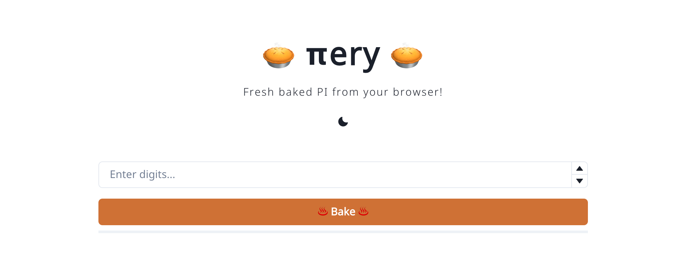

# πery

  

  <b>🥧 πery 🥧</b>
   
  <i>Fresh baked PI from your browser!</i>

## About

**πery** (Piery: /paɪəɹi/) is a web app that freshly bakes π to any number of digits by using your browser as an oven. The formula used for calculating π was inspired by [A. Jennings](http://ajennings.net/blog/a-million-digits-of-pi-in-9-lines-of-javascript.html).

## Setup

- Clone/fork this repository
- Install dependencies: `pnpm install`
- Run the development server: `pnpm dev`

## Support me

